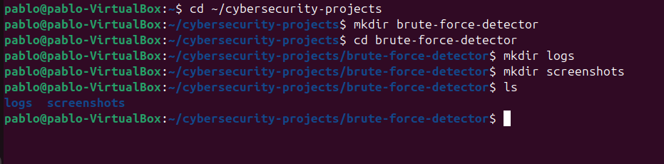
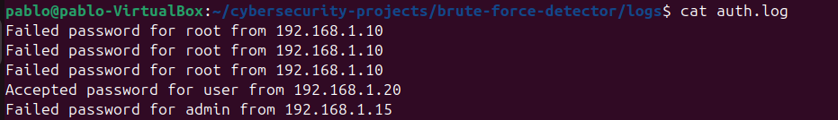
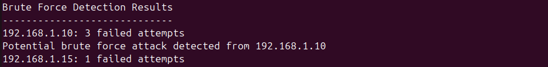
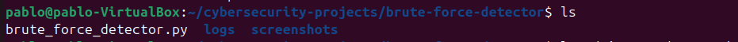

# Brute Force Detection Tool

## Overview

This project is a Python-based security monitoring tool that analyzes authentication log files and detects potential brute force login attacks.

Brute force attacks occur when an attacker repeatedly attempts to guess login credentials until successful access is achieved. Security Operations Centers (SOC) monitor authentication logs to detect this behavior.

This project simulates that detection process using Python and Linux log analysis techniques.

---

## Objective

The objective of this project is to demonstrate foundational cybersecurity skills related to:

- Log analysis
- Threat detection
- Security monitoring
- Blue Team defensive concepts

The script analyzes authentication logs and identifies repeated failed login attempts that may indicate a brute force attack.

---

## Technologies Used

- Python 3
- Linux (Ubuntu)
- Log analysis techniques
- Git & GitHub

---

## Project Structure

```
brute-force-detector
│
├── logs
│   └── auth.log
│
├── screenshots
│   ├── 01-project-folders.png
│   ├── 02-auth-log.png
│   ├── 03-detection-output.png
│   └── 04-project-structure.png
│
├── brute_force_detector.py
│
└── README.md
```

---

## Detection Process

### 1. Create the Project Workspace

Commands used:

```
mkdir brute-force-detector
cd brute-force-detector
mkdir logs
mkdir screenshots
ls
```



---

### 2. Review Authentication Logs

The authentication log file contains simulated login activity including failed login attempts from different IP addresses.

Command used:

```
cat logs/auth.log
```



---

### 3. Run the Brute Force Detection Script

The Python script scans the authentication log file and counts failed login attempts from each IP address.

Command used:

```
python3 brute_force_detector.py
```



---

### 4. Detection Results

The script identifies IP addresses with multiple failed login attempts that may indicate a brute force attack.


---

### 5. Final Project Structure

The final project structure organizes the logs, screenshots, and detection script clearly.

Command used:

```
ls
```



---

## Skills Demonstrated

This project demonstrates several cybersecurity and technical skills:

- Log analysis
- Python scripting
- Security monitoring
- Brute force attack detection
- Linux command-line usage
- Basic Blue Team detection techniques

---

## Conclusion

This project demonstrates how Python can be used to automate log analysis and detect suspicious authentication activity. While simplified, the script reflects the core logic used in security monitoring systems to identify brute force attacks and other login anomalies.

Projects like this help build practical skills used by security analysts working in Security Operations Centers (SOC).
